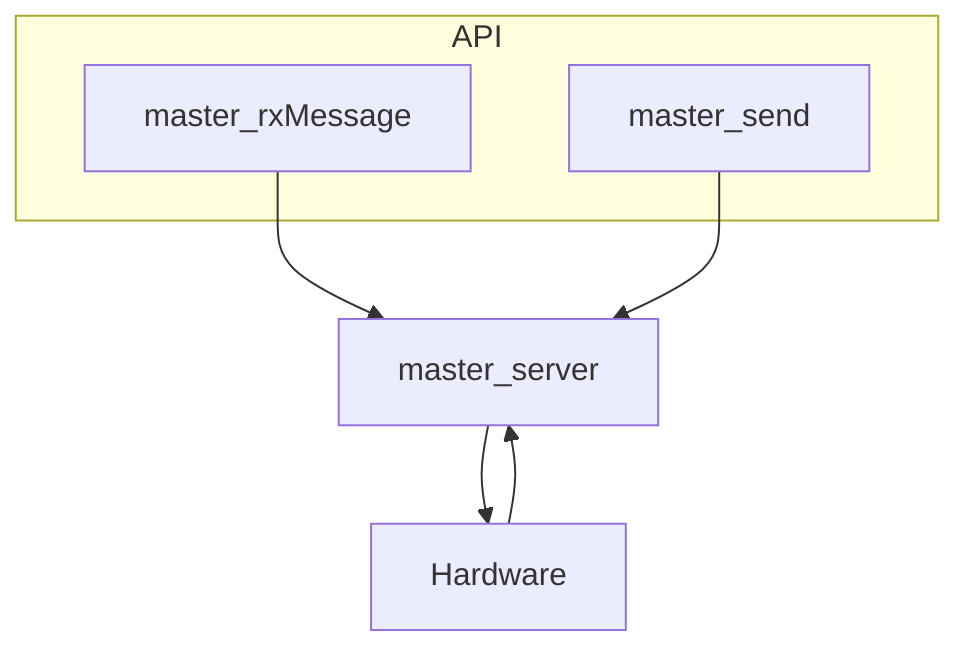
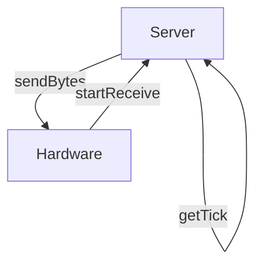

# Master Server

解析Modbus-RTU协议的主机服务器。


## 运行方式

整个服务器模块主要分为**服务器主体 (server) **和**接口函数 (API) **。

**服务器主体**的内部是一个**状态机**，需要API触发其切换。

**服务器主体**需要以一个合适的周期（如 1ms）循环执行，而<u>用户通过API向服务器主体发送指令</u>，由服务器主体和硬件进行交互。



## 如何使用


### 部署服务器主体

服务器主体，也就是`modbus_master_server()`函数，需要以一个合适的周期循环执行（典型的，如1ms）。可以在裸机程序中使用定时器中断，定时触发执行该函数，也可以在RTOS中在进程中执行该函数。

下列是一个将服务器主体部署在FreeRTOS (CMSIS_OS v2) 中的例子：

```c
// 创建该进程的代码略去。

void master_server_task(void* argument)
{
    while(1) {
        modbus_master_server(); 
        
        osThreadYield(); 
    }
}
```


### 编写功能函数

**需要注意的是**：本模块中，需要用户提供分为两类，一类是**功能函数**，一类是**回调函数**。

>   **功能函数**：用于**服务器主体**和<u>硬件的交互</u>以及<u>内部计时</u>（如部分功能需要延时）。因在不同平台上（如STM32和ESP32中），这些功能的实现方式差异较大，模块无法给出通用的解决方案，故需要用户提供。**功能函数**是**必需提供的**（不提供则服务器无法正常运行）。
>
>   **回调函数**：当某些事件发生（如接收到从机发回的寄存器数据，或是发生接收错误时），服务器会调用这些函数，并提供相关参数，这些函数的功能没有被明确定义，用户可以根据自己的需求进行编写。**回调函数**是由用户**选择性提供的**（不提供也行）。


对于使用主机服务器模块，需要用户提供三个功能函数，分别是：

>   `getTick()`: 获取当前时间戳；
>
>   `startReceive()`: 开始接收；
>
>   `sendBytes()`: 发送多个字节。



三个功能函数的说明如下，用户请根据该说明编写合适的功能函数：

#### getTick

```c
uint32_t getTick(); 
```

获取当前的时间戳。

如在使用HAL的STM32程序中，可以使用`HAL_GetTick()`，在运行FreeRTOS的程序中，可以使用`osKernelGetTickCount()`；或是用户自行编写的函数。


#### startReceive

```c
void startReceive(Modbus_Master_UserDef_t* _userDef_, 
                      uint8_t* _buf_, 
                      uint8_t  _bufSize_); 
```

开始接收

| 参数        | 描述                                                       |
| ----------- | ---------------------------------------------------------- |
| `_userDef_` | 主机设备中的用户定义字段，包含用户对于主机对象的相关设置。 |
| `_buf_`     | 接收数据所存放的缓冲区的起始地址。                         |
| `_bufSize_` | 缓冲区的大小。                                             |

**注意**

>   该功能函数必须是**非阻塞的**，即不能在函数中有太长时间的延时，否则会影响服务器主体的运行。


#### sendBytes

```c
void sendBytes(Modbus_Master_UserDef_t* _userDef_, 
               uint8_t* _pData_, 
          	   uint8_t  _len_); 
```

发送多个字节。

| 参数        | 描述                                                       |
| ----------- | ---------------------------------------------------------- |
| `_userDef_` | 主机设备中的用户定义字段，包含用户对于主机对象的相关设置。 |
| `_pData_`   | 发送数据的起始地址。                                       |
| `_len_`     | 发送数据的长度（单位：字节）。                             |


### 编写回调函数

使用主机服务器时，有用户可以提供两个回调函数：

>   `readReg`：读取到寄存器数据后调用的函数；
>
>   `error`：发生错误后调用的函数。


两个回调函数的说明如下：

#### readReg

```c
void readReg(Modbus_Master_UserDef_t* _userDef_, 
             Modbus_Response_t* _response_); 
```

读取到寄存器数据后调用的函数

| 参数         | 描述                                                       |
| ------------ | ---------------------------------------------------------- |
| `_userDef_`  | 主机设备中的用户定义字段，包含用户对于主机对象的相关设置。 |
| `_response_` | 包含从机的应答数据的结构体。                               |


### 创建主机设备对象

在使用服务器之前，需要创建设备对象，并将其向模块注册。

在注册对象之前，**用户需要对该对象进行一些初始化操作**，包括定义部分用户参数、定义功能函数和回调函数。

<u>设备对象的初始化时，可供用户操作的所有变量都在`.user`域内，该域内有三个子域: `def`，`func`，`cb`，分别对应用户参数，功能函数和回调函数。</u>

创建主机设备对象的过程可以参考如下代码（C99, FreeRTOS）：

```c

/* 功能函数声明 */
void rs485_startRx(Modbus_Master_UserDef_t* _userDef_, uint8_t* _buf_, uint8_t _bufSize_); 
void rs485_sendBytes(Modbus_Master_UserDef_t* _userDef_, uint8_t* _buf_, uint8_t _len_); 

/* 回调函数声明 */
void user_callback_readReg(Modbus_Master_UserDef_t* _userDef_, Modbus_Response_t* _resp_); 
void user_callback_error(Modbus_Master_UserDef_t* _userDef_, Modbus_ErrorInfo_t* _error_); 

uint8_t modbusBuf[32]; 		// 缓冲区
Modbus_MasterDevice_t masterDev = {
    .user = {
        .def = {
            .buf = modbusBuf, 
            .bufSize = 32
        }, 
        .func = {
            .getTick = osKernelGetTickCount, 
            .sendBytes = rs485_sendBytes, 
            .startRx = rx485_startRx
        }, 
        .cb = {
            .readReg = user_callback_readReg, 
            .error = user_callback_error
        }
    }
}; 
```

**注意**： 

>   设备对象不应该定义为临时变量（如函数中的非静态变量，可能在使用对象时，该对象的空间已经被回收），**应将设备对象定义为全局变量或静态变量**。


### 注册设备对象

注册设备对象后，服务器就可以正常管理该设备了。

注册设备对象需要调用以下函数： 

```c
HAL_StatusTypeDef modbus_master_register(Modbus_MasterDevice_t* _dev_); 
```

使用示例如下： 

```c
// 对象初始化代码略。

void modbus_init()
{
    modbus_master_register(&masterDev); 
}
```


## 类型说明


### Modbus_Master_UserDef_t

```c
typedef struct Modbus_Master_UserDef {
    uint8_t 		broadcastDelay; 		// 发送广播消息后的延时数；
    uint8_t			requestDelay; 			// 发送请求后的延时数；
    uint8_t 		responseTimeout; 		// 发送请求后，监听回复消息的最大时长；

    uint8_t* 		buf;	 				// 用于接收消息和发送消息的缓冲区；
    uint8_t 		bufSize; 				// 缓冲区的大小；
    
    void* 			handle; 				// 用于储存用户的数据，便于用户区分设备或者储存相关数据。
} Modbus_Master_UserDef_t; 
```

上述三个延时/超时时长可以不定义，模块内部有默认值。 


#### Modbus_Request_t

请求类型，用于告知服务器发送请求。

```c
typedef struct {
    uint8_t devAddr; 		 
    uint8_t fnCode; 
    uint8_t dataByteCnt; 
    uint8_t numOfRegs; 
    uint16_t startRegAddr; 
    uint8_t* pData; 
} Modbus_Request_t; 
```

| 成员           | 描述                                        |
| -------------- | ------------------------------------------- |
| `devAddr`      | 目标设备的地址                              |
| `fnCode`       | 功能码                                      |
| `dataByteCnt`  | 数据总字节数                                |
| `numOfRegs`    | 在多寄存器读/写操作中，需要操作的寄存器数量 |
| `startRegAddr` | 起始寄存器地址                              |
| `pData`        | 写操作时，所需写的数据的起始地址            |

对于某一具体操作（如写入单个寄存器操作），该结构体中并非所有成员都需要被赋值，根据报文的格式所需赋值相应成员即可。


#### Modbus_Response_t

回复类型，用于服务器向回调函数传递回复信息。

```c
typedef struct {
    uint8_t devAddr; 
    uint8_t fnCode; 
    uint8_t startAddr; 
    uint8_t numOfRegs; 
    uint8_t dataByteCnt; 
    uint8_t* pData; 
} Modbus_Response_t; 
```

| 成员           | 描述                                        |
| -------------- | ------------------------------------------- |
| `devAddr`      | 目标设备的地址                              |
| `fnCode`       | 功能码                                      |
| `dataByteCnt`  | 数据总字节数                                |
| `numOfRegs`    | 在多寄存器读/写操作中，需要操作的寄存器数量 |
| `startRegAddr` | 起始寄存器地址                              |
| `pData`        | 写操作时，所需写的数据的起始地址            |

对于主机服务器模块来说，该结构体中的部分成员不一定会被用到，根据报文的格式所需读取所需相应成员即可。


## 接口函数说明


#### modbus_master_register

```c
HAL_StatusTypeDef modbus_master_register(Modbus_MasterDevice_t* _dev_); 
```

向服务器模块注册[初始化](#创建主机设备对象)后的设备对象。


#### modbus_master_server

```c
void modbus_master_server(); 
```

在后台持续运行的服务器主体程序。


#### modbus_master_send

```c
HAL_StatusTypeDef modbus_master_send(Modbus_MasterDevice_t* _dev_, Modbus_Request_t* _request_); 
```

| 参数        | 描述                                 |
| ----------- | ------------------------------------ |
| `_dev_`     | 设备对象；                           |
| `_request_` | 请求结构体，包含用户定义的请求信息。 |


#### modbus_master_rxMessage

```c
HAL_StatusTypeDef modbus_master_rxMessage(Modbus_MasterDevice_t* _dev_, uint8_t _msgSize_);
```

在服务器开启接收后，告知服务器接收到的报文长度。

| 参数        | 描述                             |
| ----------- | -------------------------------- |
| `_dev_`     | 设备对象                         |
| `_msgSize_` | 所接收到的报文长度（单位：字节） |


## 使用示例

定义功能函数

```c
void rs485_startRx(Modbus_Master_UserDef_t* _userDef_, 
                   uint8_t* _buf_, 
                   uint8_t  _bufSize_)
{
    UART_HandleTypeDef* uart_handle = (UART_HandleTypeDef*)_userDef_->handle; 	// 使用def域中的handle字段储存指向uart句柄的指针。
    
    HAL_UARTEx_ReceiveToIdle_IT(uart_handle, _buf_, _bufSize_); 
}

void rs485_sendBytes(Modbus_Master_UserDef_t* _userDef_, 
                     uint8_t* _pData_, 
                     uint8_t  _len_)
{
    UART_HandleTypeDef* uart_handle = (UART_HandleTypeDef*)_userDef_->handle;
    
    HAL_UART_Transmit(uart_handle, _pData_, (uint16_t)_len_, HAL_MAX_DELAY); 	// 阻塞运行.
}
```


定义回调函数

```c
void modbus_rx_cb(Modbus_Master_UserDef_t* _dev_, Modbus_Response_t* _resp_)
{
	uint8_t i; 
	
	printf("Address: %d  \r\n", _resp_->devAddr); 
	printf("Function code: %d \r\n", _resp_->fnCode); 
	printf("Start register address: %d \r\n", _resp_->startAddr); 
	printf("Register number: %d \r\n", _resp_->numOfRegs); 
	
	for (i = 0; i < _resp_->dataByteCnt; ++i){ 
		printf("0x%x \r\n", _resp_->pData[i]); 
	}
}
```


定义设备对象

```c

uint8_t modbusBuf[32]; 
Modbus_MasterDevice_t masterDev = {
    .user= {
        .def = {
            .buf = modbusBuf, 
            .bufSize = 32, 
        }, 
        .func = {
            .getTick = osKernelGetTickCount, 
            .sendBytes = rs485_sendBytes, 
            .startReceive = rs485_startRx
        }, 
        .cb = {
            .readReg = modbus_rx_cb, 
        }
    }
}; 
```


注册设备

```c
void modbus_init()
{
    masterDev.user.def.handle = &huart1; 	// 用handle字段存放huart1的地址.
    
    modbus_master_register(&masterDev); 
}
```


部署服务器主体

```c
// 创建进程代码略。

void modbus_server_task(void* argument)
{
    while(1) {
        modbus_master_server(); 
        
        osThreadYield(); 
    }
}
```


用户的发送读取寄存器请求函数

```c
// 创建进程代码略

void modbus_send_task(void* argument) 
{
	Modbus_Request_t req; 
	while(1) {
		req.devAddr = 0x01; 
		req.fnCode = Modbus_FunctionCode_ReadRegisters; 
		req.startRegAddr = 0x0000; 
		req.numOfRegs = 1; 
		
		modbus_master_send(&masterDev, &req); 
		
		osDelay(2000); 		// 每2s执行一次。
	}
}
```

